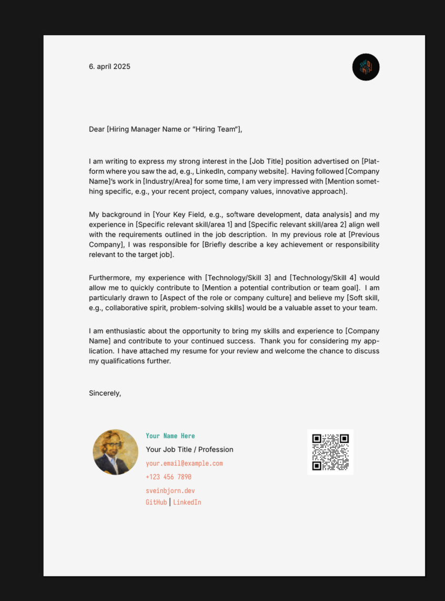

# LaTeX Cover Letter Template

This repository provides a reusable LaTeX template for creating modern, professional cover letters, optimized for screen reading. It separates the structural and styling elements (`coverletter.cls`) from the content (`.tex` files), promoting consistency and ease of use.

 <!-- Add a screenshot later if possible -->

## Features

*   **Clean, Modern Design:** Focuses on readability with appropriate font choices, spacing, and layout.
*   **Reusable Class:** Defines document structure, styles, colors, fonts, and signature block in `coverletter.cls`.
*   **Screen-Optimized:** Includes options for slightly off-white background and increased line spacing for better on-screen comfort.
*   **Customizable Signature:** Easily configure personal details, contact information, links, signature image, and QR code via simple commands.
*   **Configurable:** Uses standard LaTeX packages for geometry, fonts, colors, etc.
*   **Makefile:** Simple `make` command to build the PDF using `latexmk` and `xelatex`.

## Dependencies

1.  **LaTeX Distribution:** A modern LaTeX distribution is required, such as [TeX Live](https://www.tug.org/texlive/) (recommended for Linux/Windows/Mac) or [MiKTeX](https://miktex.org/) (Windows). The template uses `xelatex` for Unicode and modern font support.
2.  **LaTeX Packages:** The class file relies on several standard and common packages. A full TeX Live installation should include them. Key packages include:
    *   `babel` (for language support, e.g., Icelandic)
    *   `fontspec` (for loading system fonts)
    *   `xcolor` (for color definitions and page color)
    *   `hyperref` (for clickable links)
    *   `graphicx` (for images)
    *   `geometry` (for page margins)
    *   `fontawesome5` (for icons, if used - currently not used but loaded)
    *   `tikz` (for image clipping)
    *   `setspace` (for line spacing)
    *   `array` (for advanced table column types)
    *   `kvoptions` (for class options, if added later)
3.  **Required Fonts:** The template is configured to use specific fonts that need to be installed on your system:
    *   **[Inter](https://fonts.google.com/specimen/Inter):** Used as the main body font. The template specifically looks for the "Inter Nerd Font Propo" variant in `/usr/share/fonts/inter/`. You may need to adjust the `Path` in `coverletter.cls` or install the font globally. ([Nerd Fonts version](https://www.nerdfonts.com/font-downloads))
    *   **[Iosevka](https://typeof.net/Iosevka/):** Used as the monospace font in the signature block. Ensure it's installed and accessible by `fontspec`.
    *   *Font paths in `coverletter.cls` might need adjustment based on your OS and installation method.*
4.  **Make:** The build process uses a `Makefile`. `make` should be available on most Linux/macOS systems. Windows users might need to install it (e.g., via WSL or Chocolatey).

## Usage

1.  **Clone Repository:**
    ```bash
    git clone https://github.com/Raudbjorn/cover-letter.git # Replace with your repo URL
    cd cover-letter
    ```
2.  **Install Dependencies:** Make sure you have LaTeX, the required packages, and the fonts installed.
3.  **Prepare Images:**
    *   Place your logo file (e.g., `logo.png`) in the main directory.
    *   Place your circular signature image (e.g., `signature.png`) in the main directory.
    *   Place your QR code image (e.g., `qr.png`) in the main directory.
4.  **Create Content File:**
    *   Copy `example_letter.tex` to a new file (e.g., `my_cover_letter.tex`).
    *   Edit the new file:
        *   Fill in your details in the `\signature...` commands.
        *   Update the placeholder paths for `\signatureImageFile`, `\signatureQRCodeFile`, and the logo in the `tabular*` if they differ from the defaults.
        *   Write your cover letter content.
5.  **Build:**
    *   Open your terminal in the project directory. There are several ways to build:
    *   **Build only your letter(s) (Default):** Run `make` without arguments. This builds all `.tex` files *except* `example_letter.tex`.
      ```bash
      make
      ```
    *   **Build ALL letters (including example):** Run `make all`.
      ```bash
      make all
      ```
    *   **Build only the example letter:** Run `make example`.
      ```bash
      make example
      ```
      This generates `example_letter.pdf`.
    *   **Build a specific letter:** Run `make` followed by the base name (e.g., `make my_letter` builds `my_letter.pdf`).
      ```bash
      make my_letter
      ```
    *   Make sure any required image files (logo, signature, QR) are present in the directory when building specific letters.

6.  **Clean Up:**
    ```bash
    make clean
    ```
    This removes temporary LaTeX files and all generated PDFs in the directory.

## Customization

*   **Colors:** Modify the `\definecolor` commands in `coverletter.cls`.
*   **Fonts:** Change the `\setmainfont` and `\newfontfamily` commands in `coverletter.cls`. Remember to update font paths if necessary.
*   **Margins/Layout:** Adjust the `\geometry` settings in `coverletter.cls`.
*   **Spacing:** Modify `\parskip` and `\setstretch` values in `coverletter.cls`.
*   **Language:** Change the `babel` package option (e.g., `[english]`) in `coverletter.cls` if writing in a different language.

## License

MIT License
